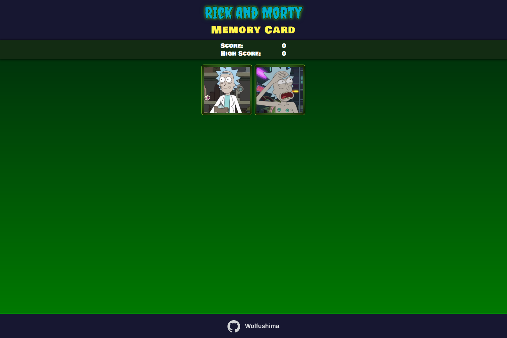
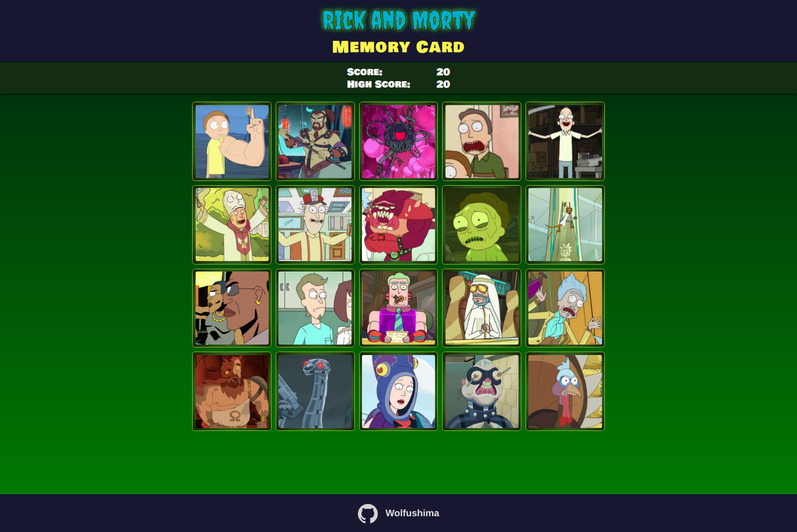

# React Memory Card Application

## Live Demo

https://wolfushima.github.io/react-memory-card/

## Description

The main goal of this project is to use `React hooks` or `lifecycle methods`.

- How life cycle methods differentiate from Class Components and Functional Components
- The way to declare a state in functional components with `useState`
- Lifecycle methods in functional components (componentDidMount, componentDidUpdate, componentWillUnmount) can be set with `useEffect`

## Built with

- React
- JavaScript
- HTML
- CSS
- Sass
- Uniqid
- rickandmorty`api`

## Application Description

The idea of the game is to remember the last card/cards you clicked on, each time you click on a card the current cards will shuffle(get sorted randomly) and now you have to click on a different card until you have clicked them all.

The game starts with 2 cards and as your score gets higher the difficulty does too until a maximum of 20 cards, then the cards will be replaced randomly for 20 new ones until you lose.

Each time the game starts or the difficulty increases a new set of random cards gets `fetched` from the `rickandmortyapi`.

## Screenshots

<kbd></kbd>

<kbd></kbd>
